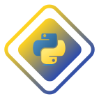

# 📚 Python Study Repository

Este repositório contém meus estudos, anotações e exercícios práticos relacionados à linguagem **Python**.  
O objetivo é documentar minha evolução, criar uma base de códigos reutilizáveis e aplicar conceitos aprendidos.

---

## 🛠️ Tecnologias e Ferramentas
- **Linguagem:** Python 3
- **Editor:** VS Code

---

## 📖 Conteúdos Abordados
- Sintaxe e variáveis
- Estruturas de decisão e repetição
- Funções e escopo
- Manipulação de listas, tuplas, dicionários e conjuntos
- Fila, Árvore Binária, Grafo
- Hash
- Matrizes

---

## 🚀 Como Executar
1. **Clonar este repositório**
   ```bash
   git clone https://github.com/seu-usuario/nome-do-repositorio.git
   cd nome-do-repositorio

2. Executar um script
   ```bash
   python nome_do_arquivo.py
   ```
  > É recomendado ter o Python 3 instalado e configurado no PATH do sistema.

---

<div align="center">
   
</div>
